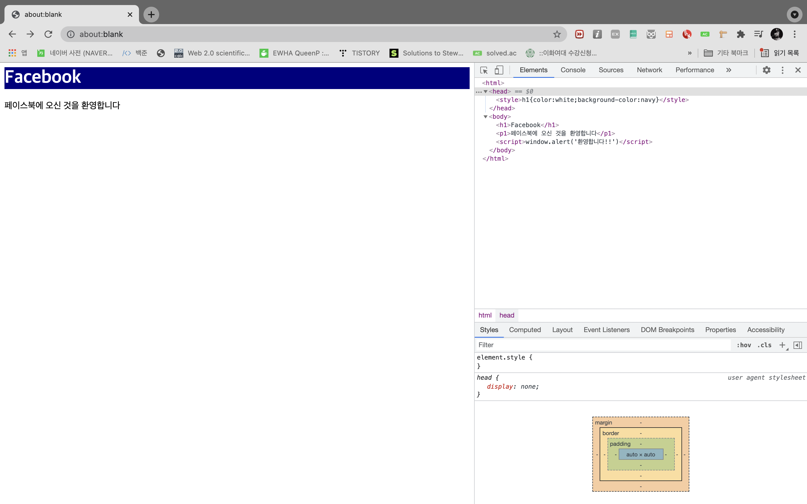
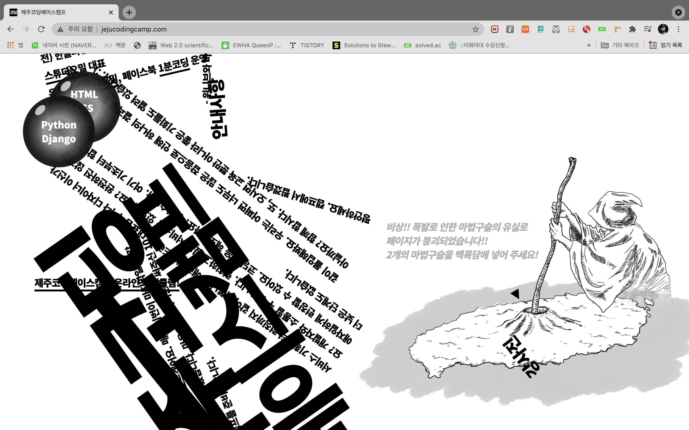

# 인스타그램 클론 - full stack 웹 개발 
# 공부기록
front-end와 back-end 모두 배울 수 있는 좋은 강의인데다, 코딩 강의로 유명한 <제주코딩베이스캠프>가 만든 강의여서 수강하게되었다. 이번 여름방학 안에 다 듣는 것이 목표이다!! 
### 20210711
- HTML(Hyper Text Markup Language : 하이퍼텍스트 마크업 언어)
  - 웹을 만들기 위한 가장 기초적인 언어!
  - html은 프로그래밍 언어가 아니다.(몰랐다...)
    - 
  - 프로그래밍 언어 : 문제를 해결하기 위해 컴퓨터에게 주어지는 처리방법과 순서를 정해주는 명령문을 작성하는 언어
  - 마크업 언어 : 구조를 정하는 언어 -> 문서의 골격을 나타내준다.
    - c.f. 마크다운(markdown)언어 : 노션, ###으로 나타낸다.
  - 하이퍼텍스트란 ? 
    - 참조를 통해 한 문서에서 다른 문서로 즉시 이동할 수 있는 텍스트
    - 하이퍼링크는 원래 알고 있었는데 단순한 링크, 텍스트를 넘어서 다른 문서,링크로 이동할 수 있기 때문에(클릭하면 다른 곳으로 넘어간다) <하이퍼>라는 접두사가 앞에 붙는 것이다.
    - e.g. 위키피디아에는 하이퍼텍스트가 짱많다!!(나는 비비 좋아해서 위키피디아에 비비를 검색해봤다! ㅎㅎ)
    - 
  - 마크업이란? 
    - 문서의 구조를 표현하는 역할을 한다. '마크업언어'도 있고, '마크다운언어'도 있다. 지금 내가 작성하고 있는 리드미파일(README.md)또한 마크다운 문서이다. (md = markdown의 줄임말이기 때문이다.)
크롬 -> 개발자도구를 통해서 웹 화면 변경하기 실습

- CSS(Cascading Style Sheet : 캐스캐이딩 스타일 시트 *캐스캐이딩 : 계단식, 위에서 아래로 흐르는*)
  - 스타일시트 : 글꼴의 크기, 모양, 컬러, 문단 설정 등 미리 정의해 스타일로 만들었다가 웹문서의 본문에서 그 스타일을 참조하여 사용하는 기능 -> html은 뼈대 css는 살인 것이다.
  - 
- Javascript(JS) : JAVA의 명성에 힘입기 위해 이름을 따온 것 말고는 따로 연관성 없다. -> 동적언어(근육,액션)
  - c.f. HTML,CSS : 정적언어
  - 제주코딩베이스캠프의 웹사이트는 매우 동적이다.(http://www.jejucodingcamp.com/) by javascript
  - 
- 그렇다면 css,html,javascript만 알면 프론트엔드(front-end) 개발자?! NONONO
  - jquery 알면 좋고 + node/express 중 하나를 셀렉해서 공부를 하면 좋을 것이다.
- 백엔드(back-end) : cloud, version, app, DB, AI, 시각화, 크롤링까지 여러 분야가 있다. 
오늘은 <프론트엔드 개발자> <CSS,HTML,Javascript>에 대해서만 배우기로 한다.
---------
### 공부리뷰
원래는 이렇게 하나하나 캡쳐하고 기록하지 않았는데, 객지프와 리액트튜터링을 하면서 꾸준히 기록하고 리뷰하는 것이 얼마나 중요한지를 꺠달았다. 원래 한 페이지에 다 정리하려고 했는데, 실습양이 많아서 강의 별로 파일을 다르게 해서 깃허브에 업로드 해야겠다. 오늘은 html, css, javascript, 그리고 프론트엔드에 대해서 배웠다. 오늘은 주말(일요일)이라서 연주언니랑 수안이랑 리액트 스터디를 하는 날이었다. 열심히 1시간 반동안 클론코딩을 하고 와서 프론트엔드에 대한 관심이 최고조일 때 강의를 들어서 더 쏙쏙 이해된 것 같다. 여러 강의를 들으며 시행착오를 겪고 깨달은 점은 아무리 하찮아보이는 실습이라고 해도, 쉬워보여서 할 가치가 없어보이더라도 막상 새로운 창을 전체화면으로 켜고 덩그러니 나 혼자 남겨지면 생각보다 어렵다는 것이다. 그리고 실습하지 않으면 절!대! 아무것도 남지 않는다. <기록>과 <실습>, 그리고 성실함 없이는 발전할 수가 없다. html은 뼈대, css는 살, 그리고 javascript는 근육이다. 동적인 역할을 담당한다는 것이다. 실제로 css,html은 정적언어이고, js는 동적언어이다. window.alert로 창을 띄우는 것을 실습했는데, 크롬에서 바로 실습해서 그런건지 잘 안되어서 그건 좀 아쉬웠다 ㅠ 그리고 리액트튜터링에서도 배웠지만 html, css는 프로그래밍 언어가 아니고, 구조를 정하는 <마크업>언어이다!! 그리고 프론트엔드라는 것은 사용자가 실제로 보는 화면에 대해 개발하는 사람이다. 하지만, 내가 생각했던 것 보다는 깊이 들어간다는 것 잊지말자!! 그리고 백엔드 개발자가 하는 일에 대해서도 간단하게나마 다뤘는데 클라우드, 버전, 앱, 데이터베이스, 인공지능, 시각화, 크롤링 등이 있었다. 막연하게 크롤링...인공지능... 이 렇게 동떨어져서 알고 있엇는데 이게 모두 백엔드의 분야라는 것을 큰 틀에서 알게 되었다. 빅픽쳐를 알게되니, 개발이라는 분야를 좀 더 이해하기 쉬워졌다. 아직은 프론트에 더 흥미가 있지만 백엔드도 꼭 배울 것이다. 백엔드가...연봉을..많이준다고 하더라..ㅋㅋ 그리고 자바스크립트는 자바랑 아무 관련이 없다. 이름빼고! 그냥 하도 자바가 유명하니까 유명해지고 싶어서 <자바!>스크립트라고 이름지었다고 한다. 내가 봐도 자바랑 별 연관이 없을 것 같기는 했는데, 그래도 진짜로 연관이 없다라는 얘기를 들으니 좀 황당했닼 ㅋㅋ... 다음 수업도 아자아자🐥🐥
