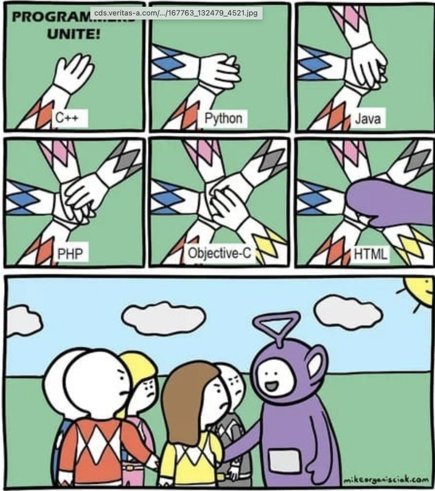
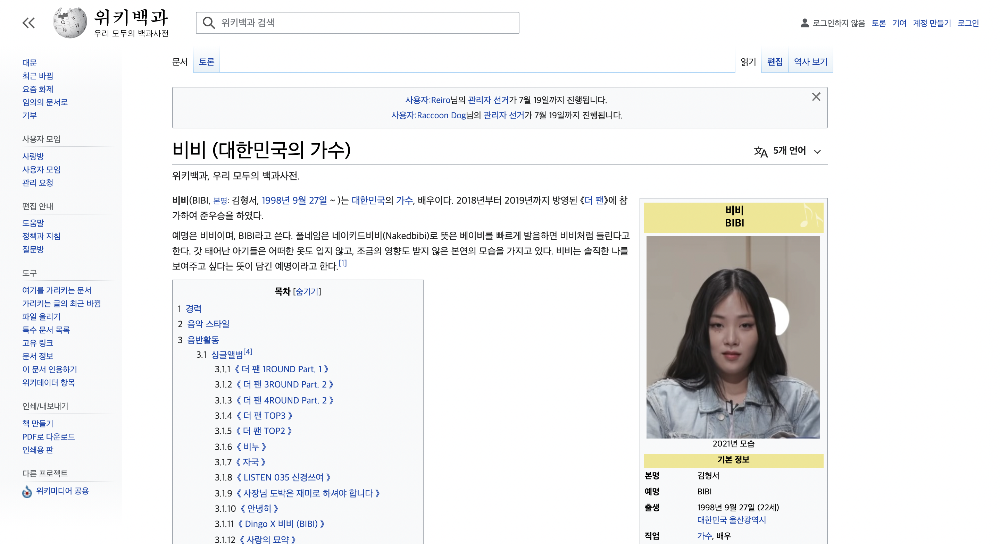
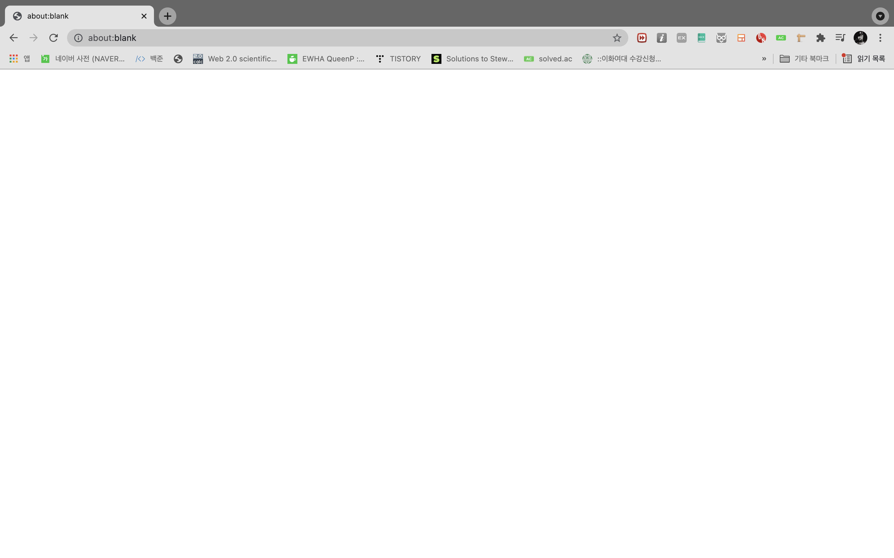
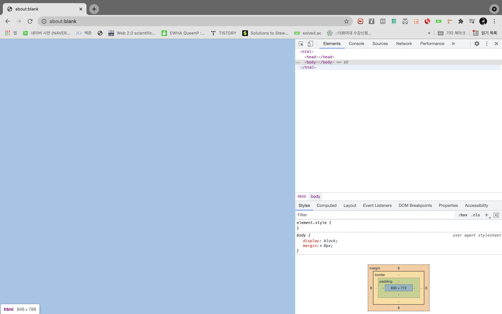
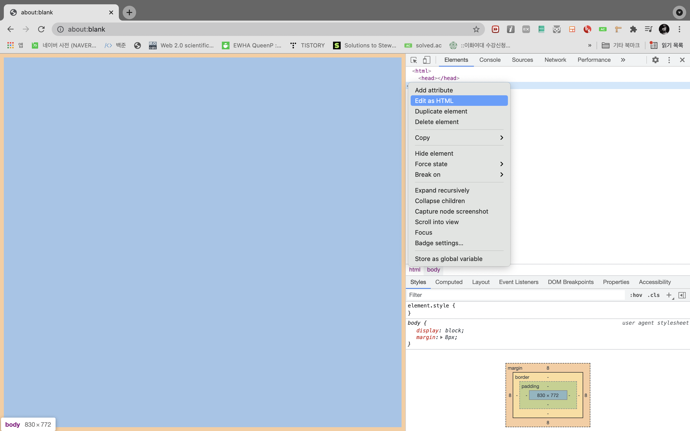
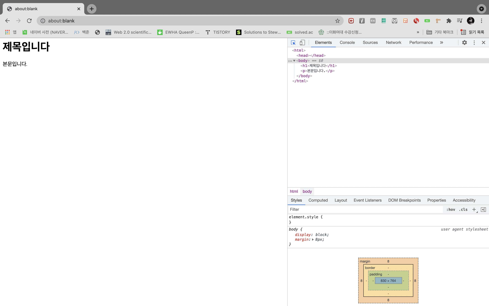
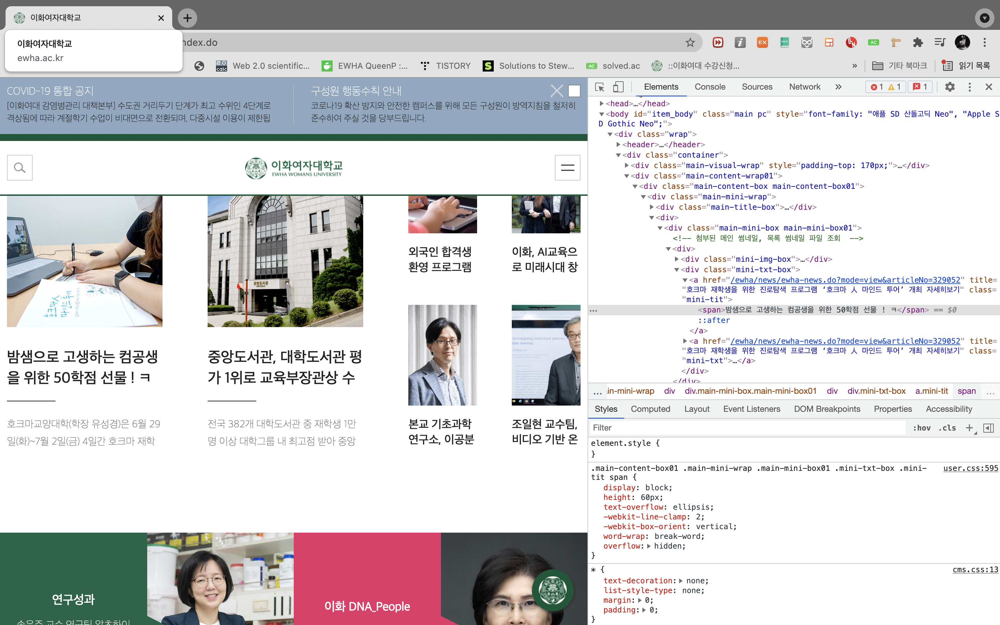

# 인스타그램 클론 - full stack 웹 개발 
# 공부기록
front-end와 back-end 모두 배울 수 있는 좋은 강의인데다, 코딩 강의로 유명한 <제주코딩베이스캠프>가 만든 강의여서 수강하게되었다. 이번 여름방학 안에 다 듣는 것이 목표이다!! 
### 20210711
- HTML(Hyper Text Markup Language : 하이퍼텍스트 마크업 언어)
  - 웹을 만들기 위한 가장 기초적인 언어!
  - html은 프로그래밍 언어가 아니다.(몰랐다...)
    - 
  - 프로그래밍 언어 : 문제를 해결하기 위해 컴퓨터에게 주어지는 처리방법과 순서를 정해주는 명령문을 작성하는 언어
  - 마크업 언어 : 구조를 정하는 언어 -> 문서의 골격을 나타내준다.
    - c.f. 마크다운(markdown)언어 : 노션, ###으로 나타낸다.
  - 하이퍼텍스트란 ? 
    - 참조를 통해 한 문서에서 다른 문서로 즉시 이동할 수 있는 텍스트
    - 하이퍼링크는 원래 알고 있었는데 단순한 링크, 텍스트를 넘어서 다른 문서,링크로 이동할 수 있기 때문에(클릭하면 다른 곳으로 넘어간다) <하이퍼>라는 접두사가 앞에 붙는 것이다.
    - e.g. 위키피디아에는 하이퍼텍스트가 짱많다!!(나는 비비 좋아해서 위키피디아에 비비를 검색해봤다! ㅎㅎ)
    - 
  - 마크업이란? 
    - 문서의 구조를 표현하는 역할을 한다. '마크업언어'도 있고, '마크다운언어'도 있다. 지금 내가 작성하고 있는 리드미파일(README.md)또한 마크다운 문서이다. (md = markdown의 줄임말이기 때문이다.)
크롬 -> 개발자도구를 통해서 웹 화면 변경하기 실습

- CSS(Cascading Style Sheet : 캐스캐이딩 스타일 시트 *캐스캐이딩 : 계단식, 위에서 아래로 흐르는*)
  - 스타일시트 : 글꼴의 크기, 모양, 컬러, 문단 설정 등 미리 정의해 스타일로 만들었다가 웹문서의 본문에서 그 스타일을 참조하여 사용하는 기능 -> html은 뼈대 css는 살인 것이다.
- Javascript(JS) : JAVA의 명성에 힘입기 위해 이름을 따온 것 말고는 따로 연관성 없다. -> 동적언어(근육,액션)
  - c.f. HTML,CSS : 정적언어
  - 제주코딩베이스캠프의 웹사이트는 매우 동적이다.(http://www.jejucodingcamp.com/) by javascript
- 그렇다면 css,html,javascript만 알면 프론트엔드(front-end) 개발자?! NONONO
  - jquery 알면 좋고 + node/express 중 하나를 셀렉해서 공부를 하면 좋을 것이다.
- 백엔드(back-end) : cloud, version, app, DB, AI, 시각화, 크롤링까지 여러 분야가 있다. 
오늘은 <프론트엔드 개발자> <CSS,HTML,Javascript>에 대해서만 배우기로 한다.
