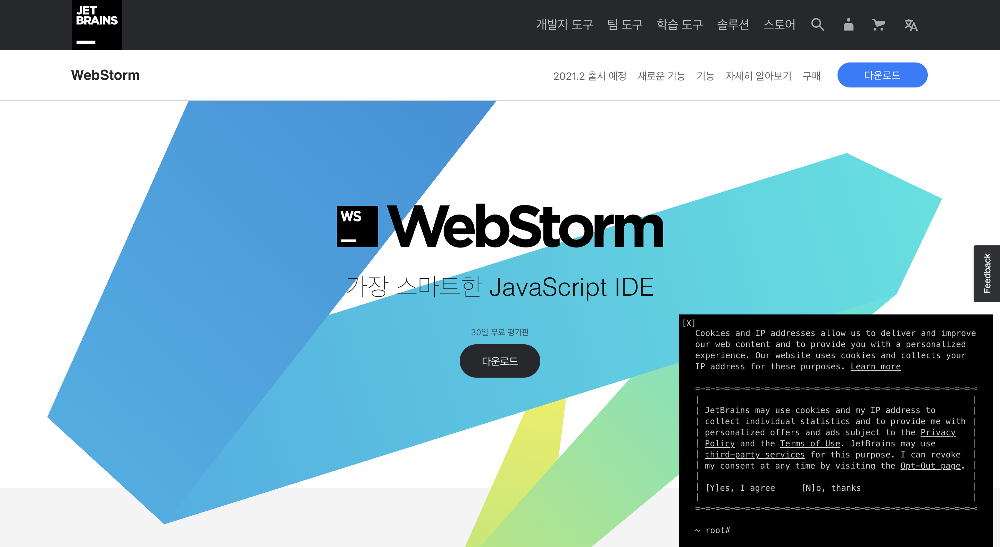
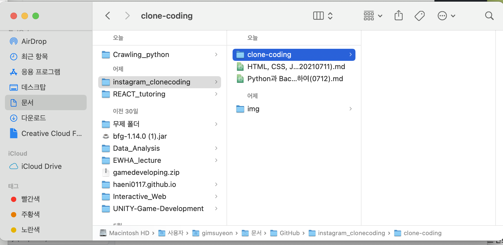

## INTRO
----
### editor download and installing
착한호랑이T가 프론트엔드부분을 강의할 것이다. 실제 영상으로 보면 호랑이 눈코입이 마우스따라서 움직인다. 아마 <움직이는 것>을 보면 js로 한 것 같다. 

사용하는 에디터 : Webstorm(근데 유료임;;)

-> 무료 사용하고 싶으면 atom추천(vscode, bracket,etc.. 뭐든 상관없음!)
- css를 사용하기 전 설정을 초기화해줄 필요가 있다. 기본설정값이 있기 때문에 resetcss 파일을 불러와서 초기화해주자.
- 새롭게 `reset.css`라는 파일을 만든 후, `index.html`에서 불러와야 한다. why? 그 상태로 두면 index파일은 reset.css파일을 참조해야하는지 유무를 알 수가 없다!
- mac은 font : monacco 로 지정하자(window는 콘솔로!)
1. 인스타그램 클론코딩할 폴더를 만들어주자

2. 클론코딩 폴더 안에  `<css> directory` 생성해주자.

## header 공부내용 정리
-----

큰 부분에서 작은 부분으로 방향성을 잡으면 좋다. 
- 인스타그램 웹페이지에서 가장 큰 containerbox를 만든 후 그 안에 게시글부분, rightbox를 만들어주는 방식 : wide -> narrow 하게 범위를 좁혀간다.
### html 코딩 시작
  - `<body></body>` 부분에서 새로운 컨데이터 박스를 만들어준다. -> `<body></body>`태그는 건들이지 않는 것이 좋다.
  - semantic하게 변수명, 태그명 설정하는 것 주의하기! (**semantic : 의미론적인) -> 아무렇게나 변수/태그명 설정하지 말라는 의미이다.
  - `<section></section>`를 사용해서 container를 만들어준다 : id를 container로 지정

- css에서 배경색을 넣어준다.
  ```
  body{
     background:#fafafa;
  }
  ```
  
- css로 header속성도 설정해준다.
  ```
  #header{
    width: 100%;
    position: absolute;
    left: 0;
    top: 0;
    z-index: 999;
    background:white;
    border-bottom:1px solid rgba(0,0,0,0.1);
  }
  ```
  - `position` : 문서 상에 요소를 배치하는 방법을 지정한다. 
   - `static` : 요소를 일반적인 문서 흐름에 따라 배치한다. -> 이렇다할 특징이 없는 디폴트상태라고 보면된다.
   - `relative` : 요소를 일반적인 문서 흐름에 따라 배치하고, 자기 자신을 기준으로 `top`, `right`, `bottom`, `left`의 값에 따라 오프셋을 적용합니다. 
    - 오프셋은 다른 요소에는 영향을 주지 않습니다. 따라서 페이지 레이아웃에서 요소가 차지하는 공간은 static일 때와 같습니다. (오프셋(offset) : 위치조정값) -> 기본값!
    - `z-index`의 값이 `auto`가 아니라면 새로운 쌓임 맥락을 생성합니다
      - `z-index`란? 위치 지정 요소와, 그 자손 또는 하위 플렉스 아이템의 Z축 순서를 지정합니다. 더 큰 z-index 값을 가진 요소가 작은 값의 요소 위를 덮습니다. 
      - Z속성은 2차원 화면에서는 보이지 않는다. 어떤 컴포넌트가 유저의 화면과 더 가깝고, 먼 지를 지수로 나타낸 속성이다. cf) 한글/powerpoint에서 앞으로보내기, 뒤로보내기와 유사한 내용을 다룬다.
      - `z-index`값이 `auto`이면 새로운 쌓임 맥락을 생성하지 않는다. -> 현재의 부모컴포넌트랑 z값이 같다.
      - `auto`가 아니라 정수(`integer`)라면? 현재 쌓임 맥락에서의 위치로 이 값을 사용합니다. 또한 자신만의 쌓임 맥락을 생성하고, 해당 맥락에서 자신의 위치를 0으로 설정합니다. 이로 인해 자손의 z-index를 자기 외의 바깥 요소와 비교하지 않습니다. 자신의 위치가 기준이 되는 것이고, 자기 보다 아래(자손)에 대해서만 쌓임맥락을 형성한다. 0번(자기 자신)바깥의 z값에 대해서는 관심이 없다.
   - 요소를 일반적인 문서 흐름에 따라 배치하고, 자기 자신을 기준으로 top, right, bottom, left의 값에 따라 오프셋을 적용합니다. 오프셋은 다른 요소에는 영향을 주지 않습니다. 따라서 페이지 레이아웃에서 요소가 차지하는 공간은 static일 때와 같습니다. (오프셋(offset) : 위치조정값)
   - `absolute` : 요소를 일반적인 문서 흐름에서 제거하고(`relative`,`static`과 다른 점), 페이지 레이아웃에 공간도 배정하지 않는다.
    - 대신 가장 가까운 위치 지정 조상 요소에 대해 상대적으로 배치합니다. 단, 조상 중 위치 지정 요소가 없다면 초기 컨테이닝 블록을 기준으로 삼습니다. 최종 위치는 top, right, bottom, left 값이 지정합니다. -> ***그럼 상대적 위치라고 보면 되는 건가? 근데 왜 이름이 absolute??

