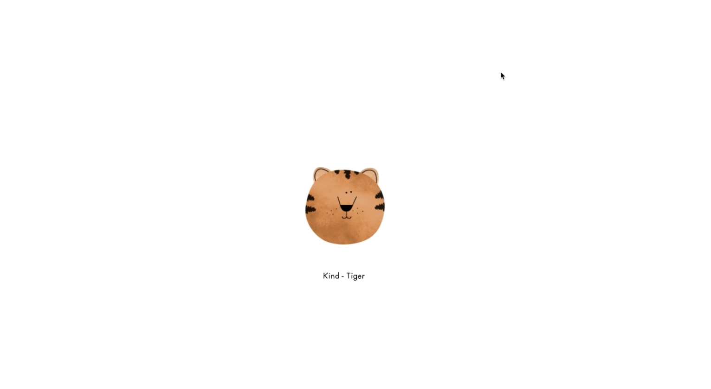

## INTRO
----
### editor download and installing
착한호랑이T가 프론트엔드부분을 강의할 것이다. 실제 영상으로 보면 호랑이 눈코입이 마우스따라서 움직인다. 아마 <움직이는 것>을 보면 js로 한 것 같다. 

사용하는 에디터 : Webstorm(근데 유료임;;)

-> 무료 사용하고 싶으면 atom추천(vscode, bracket,etc.. 뭐든 상관없음!)
- css를 사용하기 전 설정을 초기화해줄 필요가 있다. 기본설정값이 있기 때문에 resetcss 파일을 불러와서 초기화해주자.
- 새롭게 `reset.css`라는 파일을 만든 후, `index.html`에서 불러와야 한다. why? 그 상태로 두면 index파일은 reset.css파일을 참조해야하는지 유무를 알 수가 없다!
- mac은 font : monacco 로 지정하자(window는 콘솔로!)
1. 인스타그램 클론코딩할 폴더를 만들어주자

2. 클론코딩 폴더 안에 <Css> directory 생성해주자.

## header 공부내용 정리

  
  
