## INTRO
----
### editor download and installing
착한호랑이T가 프론트엔드부분을 강의할 것이다. 실제 영상으로 보면 호랑이 눈코입이 마우스따라서 움직인다. 아마 <움직이는 것>을 보면 js로 한 것 같다. 
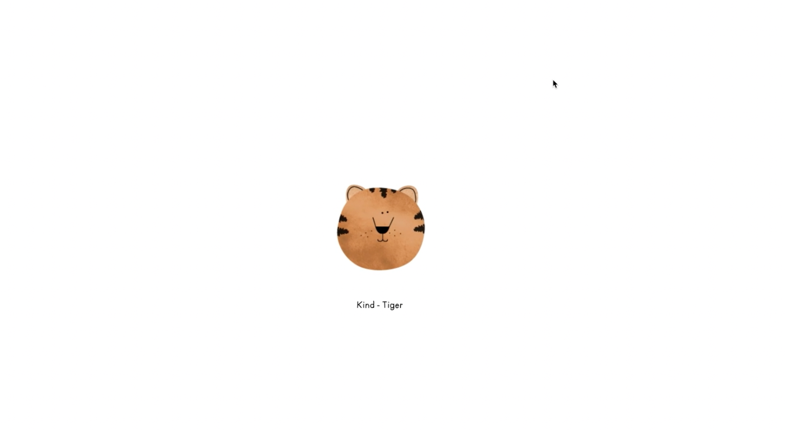
사용하는 에디터 : Webstorm(근데 유료임;;)
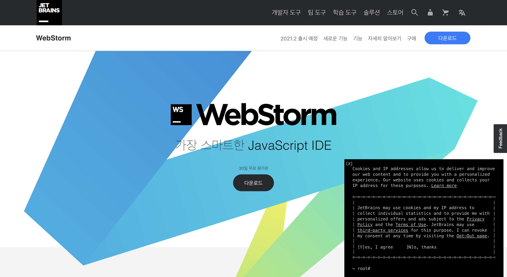
-> 무료 사용하고 싶으면 atom추천(vscode, bracket,etc.. 뭐든 상관없음!)
- css를 사용하기 전 설정을 초기화해줄 필요가 있다. 기본설정값이 있기 때문에 resetcss 파일을 불러와서 초기화해주자.
- 새롭게 `reset.css`라는 파일을 만든 후, `index.html`에서 불러와야 한다. why? 그 상태로 두면 index파일은 reset.css파일을 참조해야하는지 유무를 알 수가 없다!
- mac은 font : monacco 로 지정하자(window는 콘솔로!)
1. 인스타그램 클론코딩할 폴더를 만들어주자
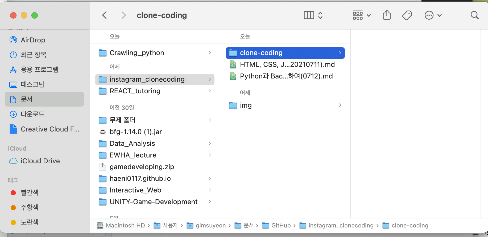
2. 클론코딩 폴더 안에  `<css> directory` 생성해주자.

## header 공부내용 정리
-----
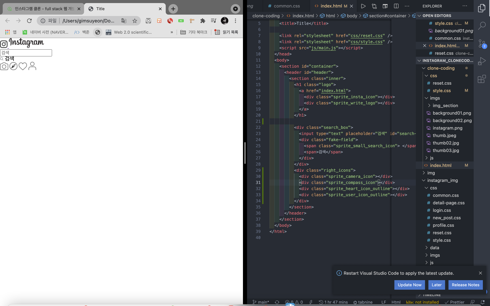
큰 부분에서 작은 부분으로 방향성을 잡으면 좋다. 
- 인스타그램 웹페이지에서 가장 큰 containerbox를 만든 후 그 안에 게시글부분, rightbox를 만들어주는 방식 : wide -> narrow 하게 범위를 좁혀간다.
### html 코딩 시작
  - `<body></body>` 부분에서 새로운 컨데이터 박스를 만들어준다. -> `<body></body>`태그는 건들이지 않는 것이 좋다.
  - semantic하게 변수명, 태그명 설정하는 것 주의하기! (**semantic : 의미론적인) -> 아무렇게나 변수/태그명 설정하지 말라는 의미이다.
  - `<section></section>`를 사용해서 container를 만들어준다 : id를 container로 지정
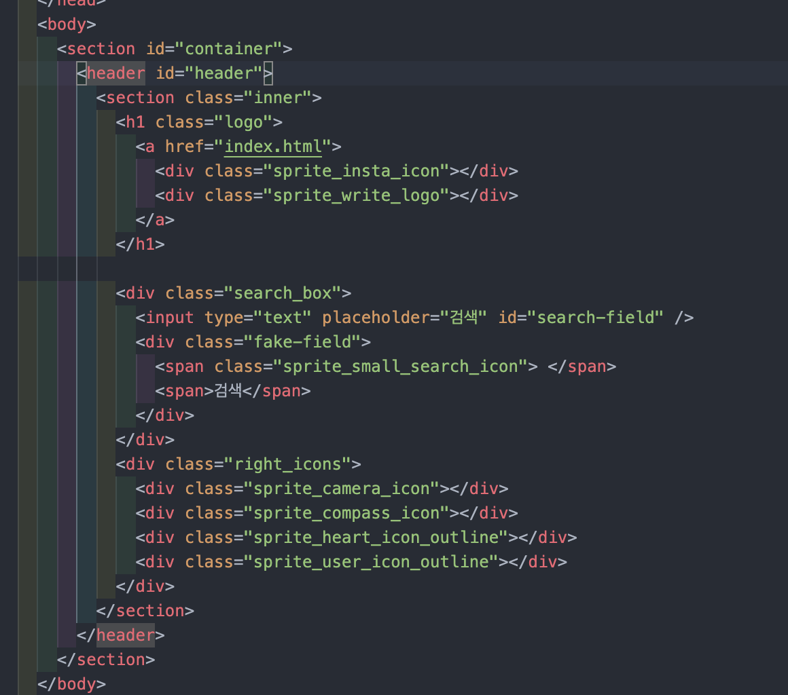
- css에서 배경색을 넣어준다.
  ```
  body{
     background:#fafafa;
  }
  ```
  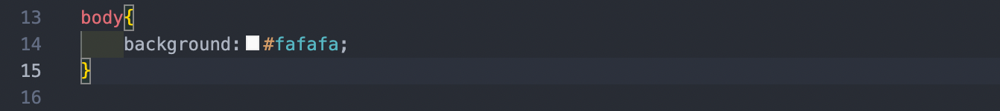
- css로 header속성도 설정해준다.
  ```
  #header{
    width: 100%;
    position: absolute;
    left: 0;
    top: 0;
    z-index: 999;
    background:white;
    border-bottom:1px solid rgba(0,0,0,0.1);
  }
  ```
  - `position` : 문서 상에 요소를 배치하는 방법을 지정한다. 
   - `static` : 요소를 일반적인 문서 흐름에 따라 배치한다. -> 이렇다할 특징이 없는 디폴트상태라고 보면된다.
   - `relative` : 요소를 일반적인 문서 흐름에 따라 배치하고, 자기 자신을 기준으로 `top`, `right`, `bottom`, `left`의 값에 따라 오프셋을 적용합니다. 
    - 오프셋은 다른 요소에는 영향을 주지 않습니다. 따라서 페이지 레이아웃에서 요소가 차지하는 공간은 static일 때와 같습니다. (오프셋(offset) : 위치조정값) -> 기본값!
    - `z-index`의 값이 `auto`가 아니라면 새로운 쌓임 맥락을 생성합니다 -> 코드에서 z-index값을 999로 설정했다. 가장 앞에 위치하기 위해서(사용자와 가장 가깝게) 
      - 따라서 정수값이 클수록 앞에 위치해 있다는 것을 알 수 있다.
      - `z-index`란? 위치 지정 요소와, 그 자손 또는 하위 플렉스 아이템의 Z축 순서를 지정합니다. 더 큰 z-index 값을 가진 요소가 작은 값의 요소 위를 덮습니다. : 말그대로 z값의 인덱스(위치)인 것이다.
      - Z속성은 2차원 화면에서는 보이지 않는다. 어떤 컴포넌트가 유저의 화면과 더 가깝고, 먼 지를 지수로 나타낸 속성이다. cf) 한글/powerpoint에서 앞으로보내기, 뒤로보내기와 유사한 내용을 다룬다.
      - `z-index`값이 `auto`이면 새로운 쌓임 맥락을 생성하지 않는다. -> 현재의 부모컴포넌트랑 z값이 같다.(굳이 신경써줄 필요가 없음)
      - `auto`가 아니라 정수(`integer`)라면? 현재 쌓임 맥락에서의 위치로 이 값을 사용합니다. 또한 자신만의 쌓임 맥락을 생성하고, 해당 맥락에서 자신의 위치를 0으로 설정합니다. 이로 인해 자손의 z-index를 자기 외의 바깥 요소와 비교하지 않습니다. 자신의 위치가 기준이 되는 것이고, 자기 보다 아래(자손)에 대해서만 쌓임맥락을 형성한다. 0번(자기 자신)바깥의 z값에 대해서는 관심이 없다.
   - 요소를 일반적인 문서 흐름에 따라 배치하고, 자기 자신을 기준으로 top, right, bottom, left의 값에 따라 오프셋을 적용합니다. 오프셋은 다른 요소에는 영향을 주지 않습니다. 따라서 페이지 레이아웃에서 요소가 차지하는 공간은 static일 때와 같습니다. (오프셋(offset) : 위치조정값)
   - `absolute` : 요소를 일반적인 문서 흐름에서 제거하고(`relative`,`static`과 다른 점), 페이지 레이아웃에 공간도 배정하지 않는다.
    - 대신 가장 가까운 위치 지정 조상 요소에 대해 상대적으로 배치합니다. 단, 조상 중 위치 지정 요소가 없다면 초기 컨테이닝 블록을 기준으로 삼습니다.
    -  최종 위치는 top, right, bottom, left 값이 지정합니다. -> ***그럼 상대적 위치라고 보면 되는 건가? 근데 왜 이름이 absolute??***
    - + ***다른 요소들과 관계성(relation)이 없어서 `absolute`라고 하는 건가?***
  - `header`의 배경색상은 white이고, 아래 라인이 있다.
  ```
   background:white;
    border-bottom:1px solid rgba(0,0,0,0.1);
  ```
    - `border-bottom` : 아래에 라인을 준다. 
    - `solid` : 단선이라는 의미(기본 선)
    - `rgba` : RGB(색상값) + A(투명도)까지 설정하겠다는 키워드
  - 이렇게 코드를 작성했음에도, 막상 페이지에는 아무것도 나타나지 않을 것이다.
    - why? 높이(height)값을 아직 주지 않았기 때문. 그러면 지금 `<header>`태그 안에서 줄 건가? nono -> (사실 엄밀하게 따지면 header태그 내부이기는 하지만..) 새로운 자식을 만들어주고 그 안에서 높이를 지정해줄 것이다.
   ```
   #header .inner{
    width: 975px;
    height: 77px;
    margin: 0 auto;
    display:flex;
    justify-content: space-between;
    align-items: center;
    transition:all 1s;
   }
   ```
   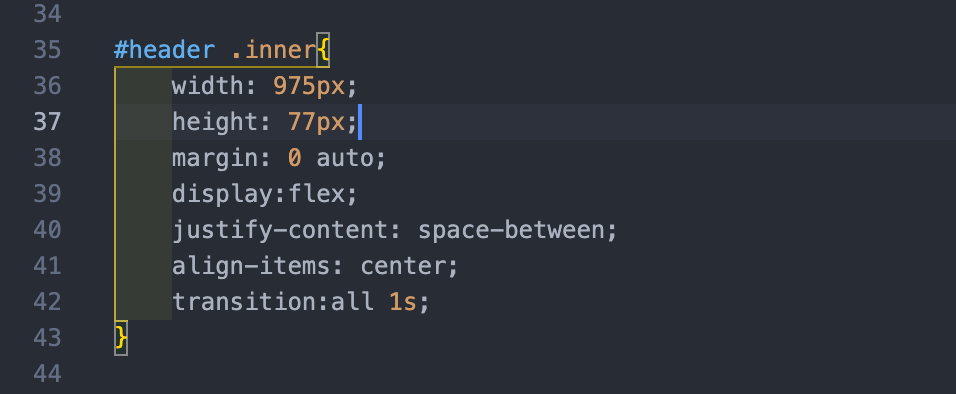
   - 자식 컴포넌트에서 height(높이) 지정까지 완료하였으니, 웹에서 확인해보자.
   -
    - 이미 실습이 좀 진행되었는데 복습용으로 작성하고 있어서, 아직 언급안된 기능+요소들이 있으니 감안해서 보시길!
    - 우리가 컨텍츠를 작성하게 되면 inner안으로 들어오게 되어있다.
   - inner안에서도 여러 구역으로 나눌 수 있다.
   - 로고박스(logo-box)
     -`<h1></h1>`태그를 사용해서 감싸준다.
     - 일반적인 웹페이지에서 로고를 클릭하면 메인화면으로 이동한다. -> `<a></a>`태그를 사용해서 링크를 걸어준다.
     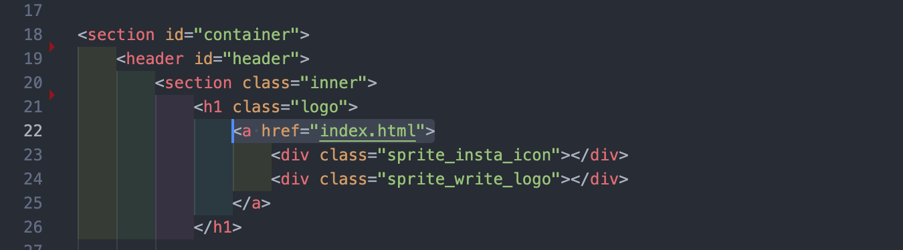
     - 코드에서 index.html이 메인페이지를 담당하고 있으므로 href를 통해 index.html을 불러온다.
     - 아이콘 배치시키기(ex.인스타그램 로고) -> http://www.spritecow.com
       - spritecow 웹페이지에 접속한다.
       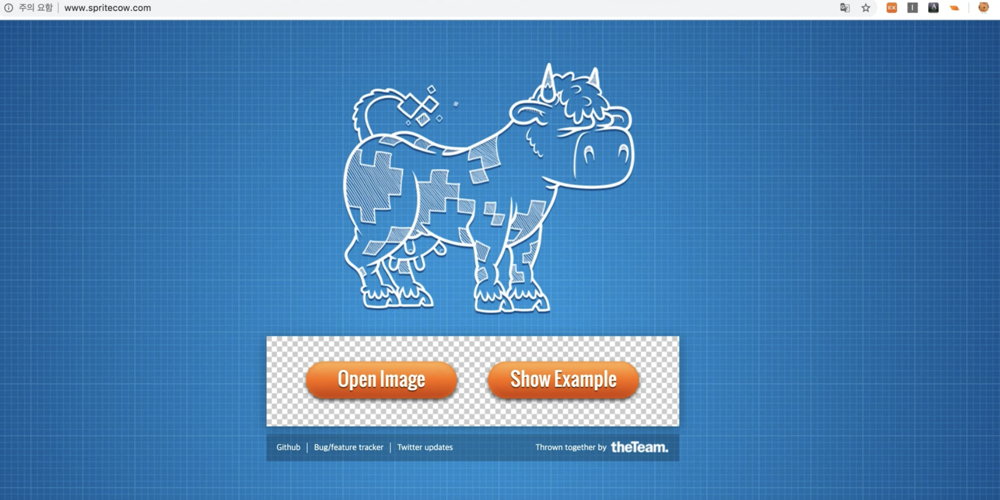
       - 이미지를 열어서 원하는 부분 선택 -> background position & image가 나온다.
       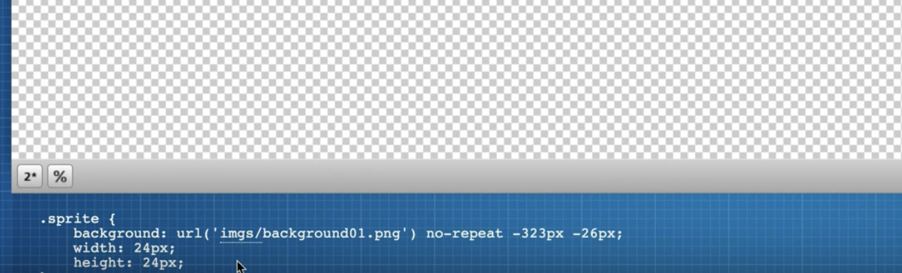
       - 백그라운드 이미지 넣을 떄 주의할 점! 백그라운드 이미지의 기본값은 0이다. 따라서 따로 height,width를 설정해주지 않으면 보이지 않는다. => 보일 영역을 지정해줘야한다.
       - `styled.css`파일에 백그라운드 이미지의 주소+설정값을 입력해준 후 `index.html`파일에 불러온다.-> 불러오는 방법 : `class=" "`형식으로 지정해주고 `<div></div>`태그로 감싸준다.
       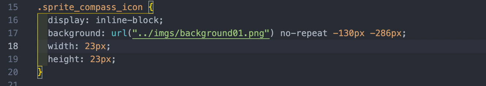
       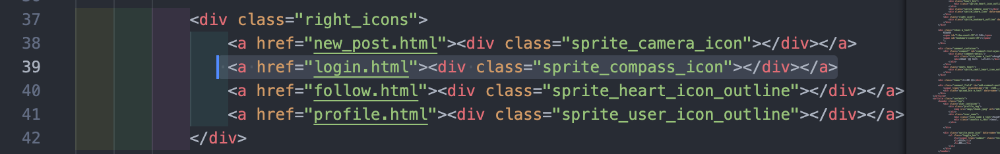
       - `display : inline-block` : 인라인 요소에 아이콘을 입력하면 형태를 가질 수 없다. + 그런데 가끔 인라인요소에 입력해야하는 경우가 있기 
       - `inline` : 가로나열. 컴포넌트 사이에 공간이 없고, 사이즈를 조정할 수도 없다. 반면에 `inline-block`과 `block`은 가능하다. 
       
     
      
    - 서치박스(search-box)!
    - 아이콘박스(icon-box)
    `
  
